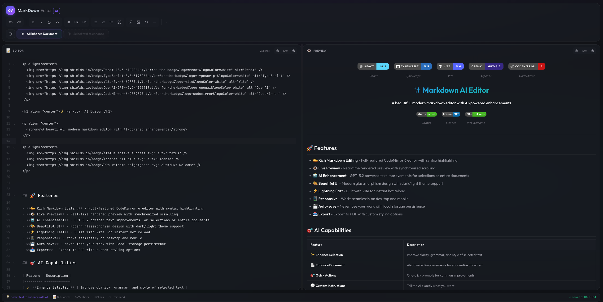

<p align="center">
  
  
  
  
  
</p>

<h1 align="center">✨ Markdown AI Editor</h1>

<p align="center">
  <strong>A modern, high-performance Markdown editor with AI-assisted rewriting, refactoring, and style normalization</strong>
</p>

<p align="center">
  
  
  
</p>

<p align="center">
  
</p>

---

## 🚀 Features

- **✍️ Rich Markdown Editing** - CodeMirror 6-based editor with Markdown syntax highlighting, keymaps, and extensible language support
- **👁️ Live Preview** - Low-latency rendering with synchronized scroll mapping between editor and preview panes
- **🤖 AI Enhancement** - OpenAI GPT-5.2 powered rewrites for selections or full documents (clarity, tone, structure, and consistency)
- **🎨 Beautiful UI** - Glassmorphism-inspired UI with theme tokens and dark/light mode switching
- **⚡ Lightning Fast** - Vite dev server for near-instant HMR and optimized production builds
- **📱 Responsive** - Adaptive split-pane layout for desktop/tablet/mobile form factors
- **💾 Auto-save** - Local persistence with resilient recovery across reloads and crashes
- **📤 Export** - PDF export pipeline with controllable print styles and layout tuning

## 🎯 AI Capabilities

| Feature | Description |
|---------|-------------|
| ✨ **Enhance Selection** | Rewrite highlighted text for clarity, grammar, concision, and technical tone while preserving meaning |
| 📄 **Enhance Document** | End-to-end improvement pass across the full Markdown file (headings, lists, code fences, and consistency) |
| 🎯 **Quick Actions** | One-click prompt presets (tighten prose, make it more technical, standardize headings, fix grammar, etc.) |
| 💬 **Custom Instructions** | Provide explicit transformation constraints (tone, audience, verbosity, style guide, terminology) |

## 📸 Preview

The editor uses a split-pane architecture:
- **Left**: CodeMirror editor with line numbers, syntax highlighting, and a formatting toolbar
- **Right**: Live-rendered Markdown preview with GitHub Flavored Markdown (GFM) compatibility
- **Floating toolbar**: Context-aware formatting controls when text is selected

---

## 🛠️ Getting Started

### Prerequisites

- **Node.js** 18+ (recommended: latest LTS)
- **npm** or **yarn**
- **OpenAI API Key** (required for AI features)

### Installation

1. **Clone the repository**
   ```bash
   git clone https://github.com/JohnDimou/MarkdownEditorAI.git
   cd MarkdownEditorAI
   ```

2. **Install dependencies**
   ```bash
   # Install frontend dependencies
   cd frontend
   npm install

   # Install backend dependencies
   cd ../backend
   npm install
   ```

### Running the App

Run **frontend** and **backend** in separate terminals:

**Terminal 1 - Backend Server:**
```bash
cd backend
node server.js
```
> 🚀 Backend listens on `http://localhost:3001`

**Terminal 2 - Frontend Dev Server:**
```bash
cd frontend
npm run dev
```
> ✨ Frontend dev server runs on `http://localhost:5173`

### Quick Start (One-liner)

```bash
# From project root - run both servers (basic convenience command)
cd backend && node server.js & cd frontend && npm run dev
```

### Configure API Key

1. Open the app in your browser
2. Click the **⚙️ Settings** gear icon (top right)
3. Go to **API Key** tab
4. Enter your OpenAI API key
5. Models will be fetched automatically from OpenAI
6. Select your preferred model and settings

> 🔒 Your API key is stored securely in your browser's local storage and sent directly to OpenAI.

---

## 📁 Project Structure

```
MarkdownEditor/
├── frontend/                # React + Vite client
│   ├── src/
│   │   ├── components/      # UI + editor components
│   │   │   ├── Editor.tsx           # CodeMirror 6 editor wrapper
│   │   │   ├── Preview.tsx          # Markdown render surface
│   │   │   ├── AIEnhanceDialog.tsx  # AI enhancement modal + prompt UI
│   │   │   ├── SettingsDialog.tsx   # Settings (API key, model selection)
│   │   │   ├── Toolbar.tsx          # Formatting + command bar
│   │   │   └── ...
│   │   ├── hooks/           # Custom React hooks (state, persistence, commands)
│   │   ├── styles/          # Global CSS + theme tokens
│   │   └── App.tsx          # App shell / layout root
│   └── package.json
│
├── backend/                 # Express.js API service
│   ├── server.js           # REST endpoints + OpenAI integration
│   └── package.json
│
└── README.md
```

---

## ⌨️ Keyboard Shortcuts

| Shortcut | Action |
|----------|--------|
| `Ctrl/Cmd + B` | Bold |
| `Ctrl/Cmd + I` | Italic |
| `Ctrl/Cmd + K` | Insert link |
| `Ctrl/Cmd + Z` | Undo |
| `Ctrl/Cmd + Shift + Z` | Redo |
| `Ctrl/Cmd + S` | Save |
| `Escape` | Close dialogs |

---

## 🎨 Themes

Toggle between **Dark** and **Light** themes using the theme control in the toolbar. The UI is tokenized and adapts automatically:

- 🌙 **Dark Mode** - Reduced glare and tuned contrast for long technical sessions
- ☀️ **Light Mode** - High legibility for bright environments and printing

---

## 🔧 Tech Stack

| Layer | Technology |
|-------|------------|
| **Frontend** | React 18, TypeScript, Vite |
| **Editor** | CodeMirror 6 |
| **Markdown** | react-markdown, remark-gfm |
| **Styling** | CSS3 with CSS Variables |
| **Backend** | Express.js, Node.js |
| **AI** | OpenAI GPT-5.2 |

---

## 📝 API Endpoints

| Endpoint | Method | Description |
|----------|--------|-------------|
| `/api/health` | GET | Health probe for uptime/monitoring |
| `/api/enhance-smart` | POST | AI enhancement endpoint (selection or full-document mode) |

---

## 🤝 Contributing

Contributions are welcome—especially improvements to editor ergonomics, prompt tooling, and export fidelity:

1. Fork the repository
2. Create a feature branch (`git checkout -b feature/amazing`)
3. Commit changes (`git commit -m 'Add amazing feature'`)
4. Push to branch (`git push origin feature/amazing`)
5. Open a Pull Request

---

## 📄 License

This project is licensed under the MIT License - see the [LICENSE](LICENSE) file for details.

---

<p align="center">
  Made with ❤️ and ✨ AI-assisted workflows by <a href="https://optimalversion.io">OptimalVersion.io</a>
</p>

<p align="center">
  <a href="#-features">Features</a> •
  <a href="#-getting-started">Getting Started</a> •
  <a href="#-tech-stack">Tech Stack</a> •
  <a href="#-contributing">Contributing</a>
</p>